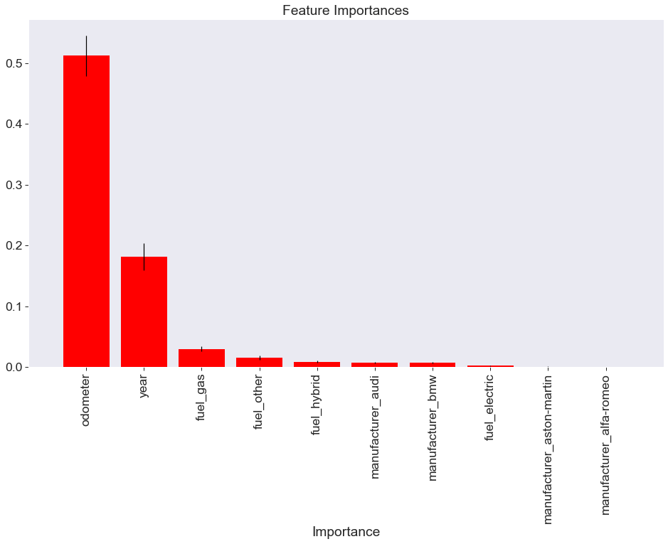

# What car should you buy?

## Motivation / Goal

Every time I go on CL I get lost and I wish it was simpler or more concrete. The UI is not creat and it’s hard to decide which is the best offer. I am planning to buy new car but I don’t know what exactly is a good deal. During my project I learned about cars and manufacturers and with the analysis and visualization, I would be able to find out what to look for in a good car deal.

## Data Description
Listing URL (unique)

Craigslist Region (categorical)

Price (integer)

Year (integer)

Manufacturer (categorical)

Make/Model (string)

Condition (categorical)

Cylinders (categorical)

Fuel (categorical)

Odometer (integer)

Title Status (categorical)

Transmission (categorical)

Vehicle Identification Number (string)

Drive (categorical)

Size (categorical)

Type (categorical)

Color (categorical)

Image URL (unique)

State (categorical)

County (categorical)

Average Location Temperature (integer)
## Exploratory Data Analysis

### Feature importance Analysis

## Conclusion

Car price prediction can be a challenging task due to the high number of attributes that should be considered for accurate prediction. The major step in the prediction process is the collection and preprocessing of the data. In this project, I normalize, standardize and clean data (removed entries containing NULL/invalid attributes) to avoid unnecessary noise for machine learning algorithms. After data cleaning & filtering, I applied unsupervised learning methods to build models to predict the used car price. The supervised methods I used include Linear Regression, Decision Tree, Random Forest, Gradient Boosting. To better understand what features models are using when making predictions, I did some further analysis on feature importance. The results aligned with my expectation and revealed some interesting difference in how different models make predictions. Some future directions include: understand better the reason behind the performance difference between different models.

## Next Steps