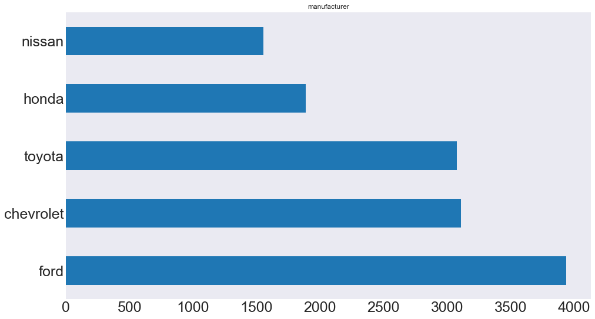
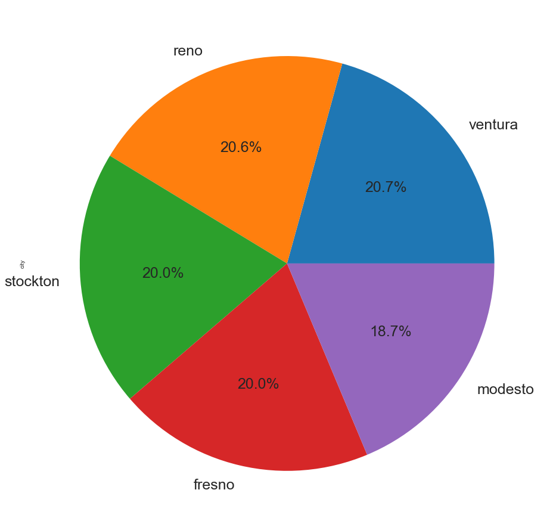
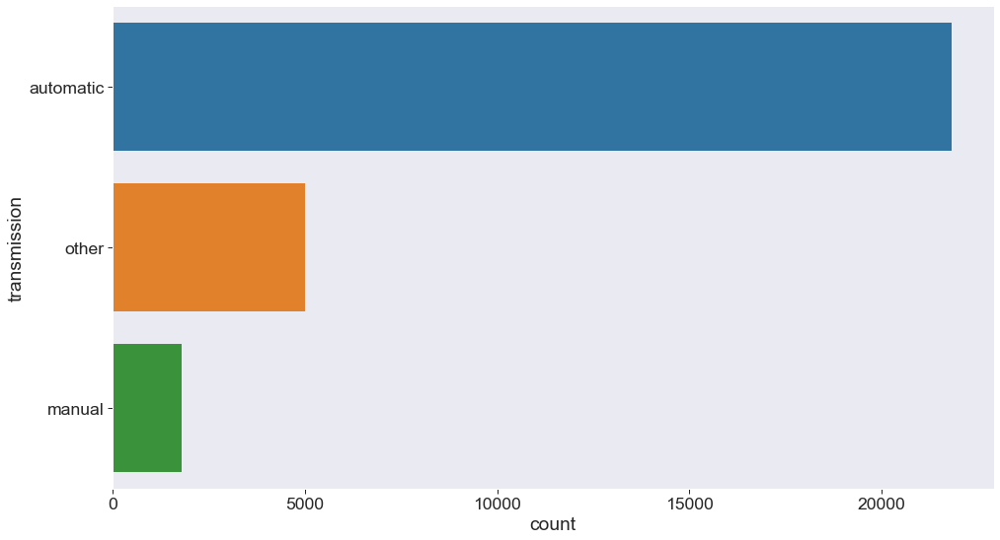
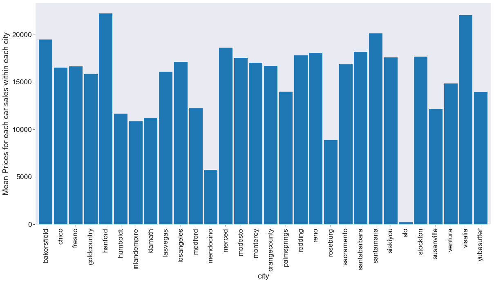
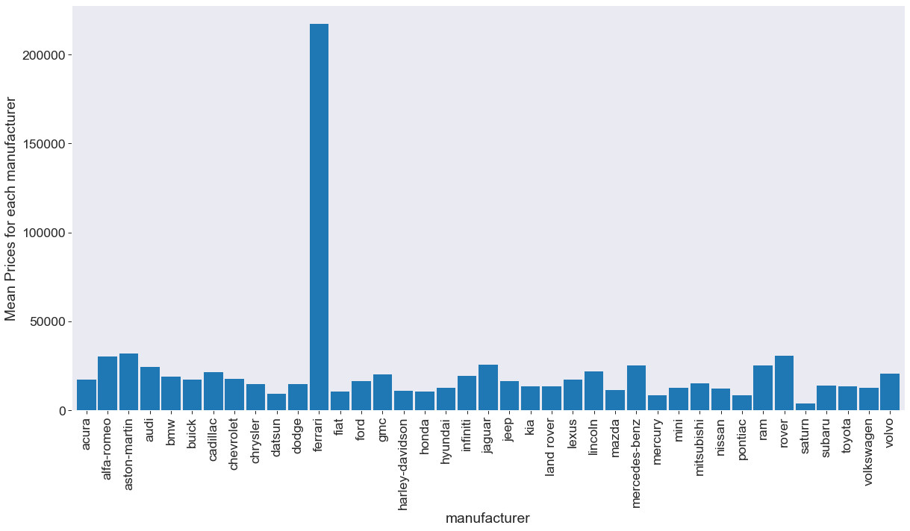
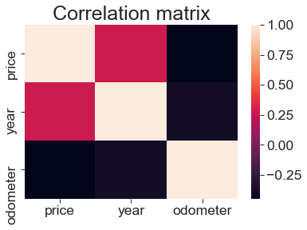

# What car should you buy?

## Motivation / Goal

Every time I go on CL I get lost and I wish it was simpler or more concrete. The UI is not creat and it’s hard to decide which is the best offer. I am planning to buy new car but I don’t know what exactly is a good deal. During my project I learned about cars and manufacturers and with the analysis and visualization, I would be able to find out what to look for in a good car deal.

## Data Description
Contain 50 000 used vehicle offers from craigslist.org
** The columns are as follows: ***
* Listing URL (unique)

* Craigslist Region (categorical)

* Price (integer)

* Year (integer)

* Manufacturer (categorical)

* Make/Model (string)

* Condition (categorical)

* Cylinders (categorical)

* Fuel (categorical)

* Odometer (integer)

* Title Status (categorical)

* Transmission (categorical)

* Vehicle Identification Number (string)

* Drive (categorical)

* Size (categorical)

* Type (categorical)

* Color (categorical)

* Image URL (unique)

* State (categorical)

* County (categorical)

I used craper which utilized python and requestsHTML to take every used car for sale form every North American Craiglist website. Saved the data in db file using sqlite and after that loaded into pandas data frame.
39 unique manufacturers, 6 unique conditions, and 4 car sizes plus 30 different cities.

##### 4 Factors:
* Manufacturer
* Condition
* City
* Year

## Exploratory Data Analysis
To predict the car price in order to find the best deal on an used car, I used 4 categories including the manufacturer, condition, city, year.
#### The Distribution of the Top 5 Car Manufacturers

This is the percentage distribution of the cars being manufactured by the top 5 manufacturers.

This is the count of the cars being manufactured by the top 10 manufacturers.

From the graph we can see the distribution of the top 5 manufacturing companies within the dataset.If you prefer Ford vehicles, Ford has the highest number of vehicles available for purchase, meaning you have a large number of vehicles to choose from. They are followed by chevrolet and toyota. Nissan has the lowest number of cars available for sale, so persons who prefer this brand may have a lower chance of finding their ideal vehicle.

#### The Distribution of the Top 5 States to Buy a Car in

This is the percentage distribution of the cars being sold in the top 5 states.

#### Condition Distribution

#### Average price per city

The graph above shows the mean prices for vehicles within each city. Persons looking for cheap vehicles, will be more likely to look at city such as Mendocino and Roseburg, as they both have a mean average of less than $9,000 for cars available for sale. Hanford and Visalia have the highest mean cost of vehicles with over $20,000. 

#### Average Price per Manufacturer

This graph shows us the mean prices of cars for each manufacturer. Luxury vehicles such as ferrari, have a high average sales price of 200 000, followed by aston-martin with average 55 000. 

#### Heated by Correlations

All numeric variables' correlations are compared in this graph. Most variables aren't correlated at all, with the exception of moderate negative correlation between price and year, slight negative correlation between year and odometer, and slight positive correlation between year and price.

### Feature importance Analysis

## Conclusion

Car price prediction can be a challenging task due to the high number of attributes that should be considered for accurate prediction. The major step in the prediction process is the collection and preprocessing of the data. In this project, I normalize, standardize and clean data (removed entries containing NULL/invalid attributes) to avoid unnecessary noise for machine learning algorithms. After data cleaning & filtering, I applied unsupervised learning methods to build models to predict the used car price. The supervised methods I used include Linear Regression, Decision Tree, Random Forest, Gradient Boosting. To better understand what features models are using when making predictions, I did some further analysis on feature importance. The results aligned with my expectation and revealed some interesting difference in how different models make predictions. Some future directions include: understand better the reason behind the performance difference between different models.

## Next Steps
Tuning the parameters of the models
